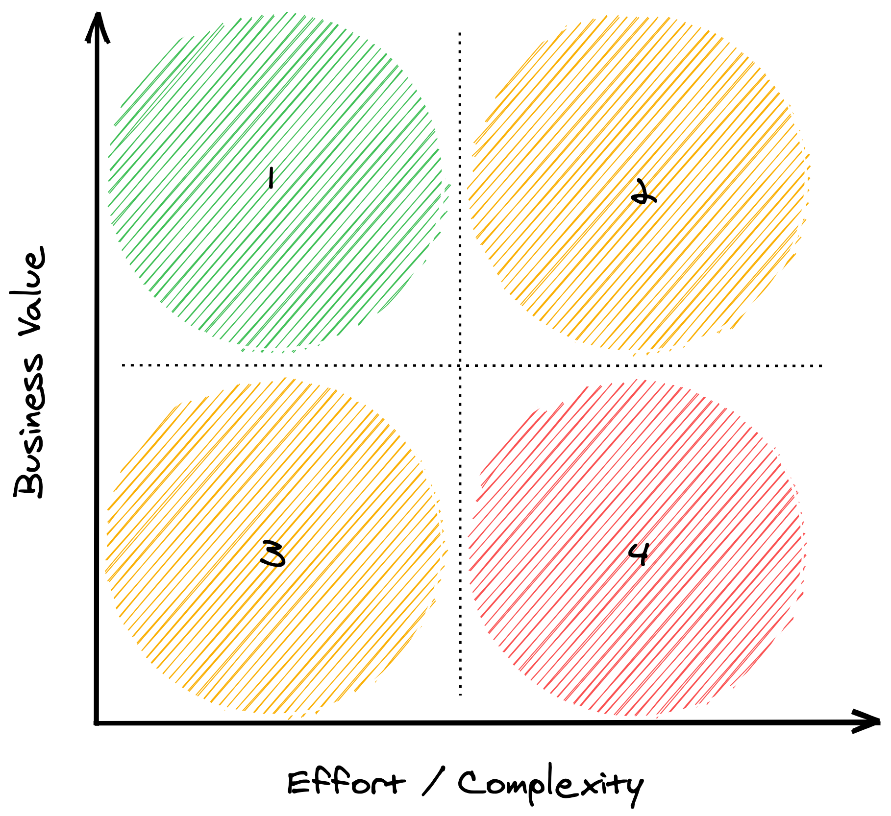
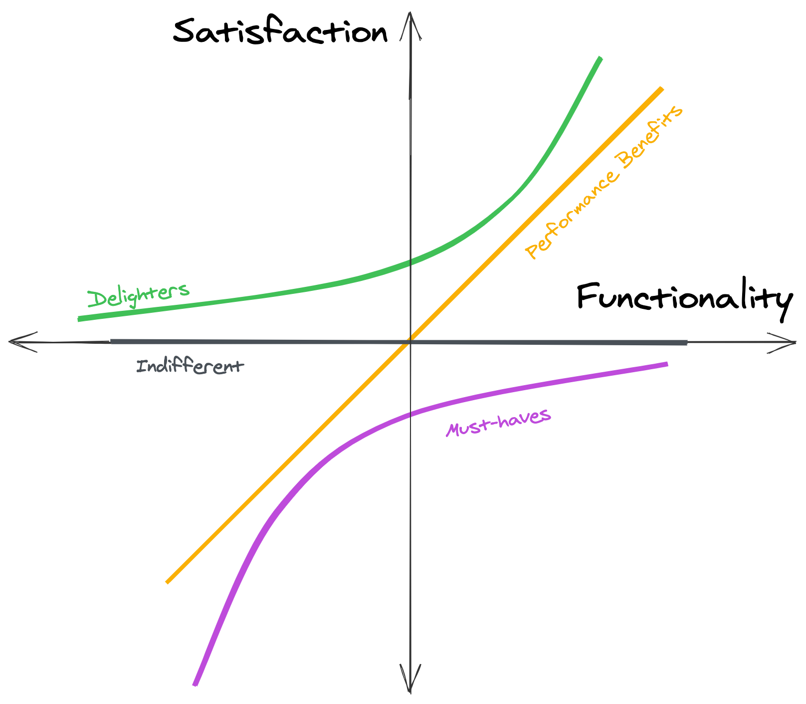

When it comes to building a product, solid execution is everything. As a Product Manager, your goal is to deliver the most valuable product feature next. The development team is going to build a full product based on the learnings of the [MVP](minimum-viable-product.html) phase and the result of the prioritization process.

During execution, many risks could prevent your team from launching the product. Technical issues, lack of resources, and tight deadlines may affect the quality of the final product.

Your job as Product Manager is to launch the product your customers are expecting using the team's resources in the best possible way.

A good practice is to use *Agile* Development, an incremental and iterative approach that allows to learn and adapt. For other products, a flavor of *Waterfall* Development may be a better approach.

{::options parse_block_html="true" /}

### On this section

- [The Product Development Lifecycle](#the-product-development-lifecycle)
	- [Discovering the Next Opportunity](#discovering-the-next-opportunity)
	- [Planning the Solution](#planning-the-solution)
	- [Creating the Solution](#creating-the-solution)
	- [Sharing the Solution](#sharing-the-solution)
	- [Evaluating the Solution](#evaluating-the-solution)
- [How Product Managers Prioritize](#how-product-managers-prioritize)
	- [Value vs. Effort](#value-vs-effort)
	- [MoSCoW Method](#moscow-method)
	- [Opportunity Scoring](#opportunity-scoring)
	- [Buy a Feature](#buy-a-feature)
	- [Story Mapping](#story-mapping)
	- [Kano Model](#kano-model)
	- [RICE Scoring](#rice-scoring)
- [What is Agile Development?](#what-is-agile-development)
	- [The Challenges of Agile](#the-challenges-of-agile)
- [Scrum vs Kanban](#scrum-vs-kanban)
	- [Scrum: A Structured Approach](#scrum-a-structured-agile-approach)
	- [Kanban: A Flexible Approach](#kanban-a-flexible-approach)
- [Dual-Track Agile](#dual-track-agile)
- [What is Waterfall Development?](#what-is-waterfall-development)

## The Product Development Lifecycle
As a Product Manager, you guide a product throughout different stages, from an idea to a product that drives user engagement and revenue for your company.

It seems easy, but it is not. 96% of built features are never used and end as a waste of resources. The reasons are multiples and depend on multiples factors. But today, after years of trial and error, we have a systematic approach to innovating that entire teams can use to work together towards better outcomes.

The next are the five essential phases that you can use as a guide to building thriving products.

### Discovering the next opportunity
What should you build next? The first phase of the product development life cycle is to find and define the next opportunity to pursue. Usually, it's up to the product manager to create and sort through all the possibilities and pick the right one to focus on next.

You start by gathering user needs from data you already have, talking with internal stakeholders, or talking directly to the users. Tools such as the business model canvas can help you structure the research. First-principles and mental models can help to uncover what is unseen and understand the needs' nature. You want to be sure you have a valid case and a reliable, strategic plan to give your product the best chance of success.

This is one of the most critical stages, where the idea is qualitatively validated by continuous communication with the customers. Methodologies like Design Sprint, Lean Startup, or Agile will align the team with collaborating in this process, driving better results and accountability.

You will leave this phase once you define a Product Requirements Document (PRD), explaining why you are pursuing the selected opportunity, the problem statement definition, and metrics to define success.

### Planning the solution
With the collected lessons from the previous phase, you and your team will work closely to figure out a desirable and feasible solution to the identified problem.

Minimum Viable Product Tests (MVP Tests) like Concierge, Wizard Of Oz, or Smoke Test are techniques used for test desirability that, with minimal effort, will allow you to put something quickly in front of the customers and see how they react. Do the users want what we have? Are we better than the alternative? This lean approach to test for value will help you avoid investing resources that generate nothing for your company.

Once motivation is validated and you have a clear value proposition, it's time to start to work on early prototypes and gain behavioral learning seeing how the customer uses it.

You leave this phase with a validated prototype as a suitable solution.

### Creating the solution
Here is where product creation begins, be it software or hardware. The first release is likely to be an MVP, containing only the core product's functionalities for your customers (enthusiasts/early adopters) to gain traction in the market. 

In order to define what should be included, you'll need to work closely with the Design and Development teams. The Customer Journey will help you visualize the most important functionality for the user at this stage. Like Story Mapping, prioritization techniques and frameworks will help you decide what is feasible with the available resources.

You will leave this phase once you define a Product Requirements Document (PRD), explaining why you are pursuing the selected opportunity, the problem statement definition, and metrics to define success.

### Sharing the solution
The MPV is validated, and users love it. It's time to launch it to the public. For a successful product launch, you work with different teams to create the Go To Market Strategy in this phase. 

Marketing, Sales, and Customer Support teams are some of the teams you want to get involved in comprehending how to succinctly and effectively communicate the product value proposition and how it makes the customer awesome.

This phase ends when you launch the product, and you start to evaluate the performance and observe how the customers received your new creation or improvement.

### Evaluating the solution
The last phase is to assess how the iteration of the cycle went, compare the metrics you set in the first step, and develop new opportunities for what to do in the next iteration.

During this phase, your team connects metrics and identifies the potential of the product. Features that prove not useful or don't generate engagement or revenue may be removed in the next iterations.

As you continue the cycle, you should return to the discovery phase with the learnings of this iteration and start over again.

Successful product teams have a robust and fertile learning process. They can carefully observe customers, translate them into actionable ideas for products, execute them as an experiment with observation, and then loopback. 

Learning is about creating this virtuous cycle where you're releasing things with bright ideas about why you think they're going to be valuable.

## How Product Managers Prioritize

A major challenge for Product Managers is to decide what to do next. The reason is simple: the company has limited resources to invest.

Stakeholders and customers represent a valuable source of feedback. But they have a limited perspective on what's possible and what’s the best way to solve a problem. Great Product Managers manage their expectations accordingly. The best way to do it is to help them understand how do you make these important decisions. If you fail to do so, you'll end up frustrating everyone involved in the product.

Most of the time you would be saying *"no"* to product requests. That's expected. But a better approach would be to say *"this is what we're doing instead, and here's why"*. The best Product Managers back up their decisions with unbiased data. Remember, every time you say yes to an opportunity, you’re also saying no to everything else.

There are many prioritization techniques and frameworks out there. Some of them are internally focused, others more externally focused. At the same time, they can be either quantitative or qualitative. But their effectiveness depends on the nature of the company (culture) and product.

There is no silver bullet. You should use these techniques as a guide rather than a definitive answer. When in doubt, turn to your [Product Vision and Strategy](vision-and-strategy.html).

### Value vs. Effort

This framework allows the product team to visualize in a simple matrix where product initiatives or features stand. You can also found as *Value vs. Cost* or *Value vs. Complexity*.

The key is to clearly define what “value” and “effort” actually mean for stakeholders. This question should trigger a healthy discussion around what’s important. As a Product Manager, this should help you get a better understanding of the bigger picture.

The goal of this framework is to maximize value every time. The matrix then breaks into the following quadrants:
- **High Value - Low Effort**: These product features are "quick-wins" and should go first.
- **High Value - High Effort**: These product features might take longer but they worth the investment.
- **Low Value - Low Effort**: Try not to do more than necessary of these product features.
- **Low Value - High Effort**: Avoid these product features when possible.

By using this matrix, a Product Manager provides a visual and quantifiable way to back up her decisions. Starting with the most valuable initiatives with low effort first, followed by high value and high effort second. As a note, low value, low effort should be carefully considered individual basis.  Ignore the rest when possible.

**The Pros**
- No complex formulas or models. Easy to pick-up.
- The *value* and *effort* definition fits any company and industry.
- Removes the guesswork and serves as a tool for alignment.
- Easy way to find “low-hanging fruits” to tackle.
- Works really well with new products.

**The Cons**
- Estimations may not very accurate.
- Stakeholders' disagreements may be time-consuming.
- It may not be as valuable for more mature products.
- It may lead to a product full of low-effort solutions.

### MoSCoW Method

A framework developed by Dai Clegg in 1994, used to figure out what matters to stakeholders and customers. The acronym comes from Must Have *(Mo)*, Should Have *(S)*, Could Have *(Co)*, Won’t Have *(W)*.

The goal is to assign product initiatives into 4 discrete categories based on *timeframe* and *importance*:

- **Must-Haves**: These features are critical and time-sensitive.  Missing even one feature would make a launch or release to fail.
- **Should-Have**: This functionality is as important as Must-Haves but not as time-sensitive.
- **Could-Have**: These features improve the [User Experience](user-experience.html) but they are not critical. They can be left out for now.
- **Won’t-Have**: These product ideas are not aligned with the [Product Strategy](vision-and-strategy.html) but they might have a chance in the future.

**The Pros**
- Simple and straightforward solution for non-technical stakeholders.
- Best suited for internal, time-boxed projects.

**The Cons**
- Limited categories may lead to an increased *Must-Have* list.
- Difficult to implement at scale.

### Opportunity Scoring

This technique comes from Anthoney Ulwicks’ *Outcome-Driven Innovation (ODI)* framework. Also known as *Opportunity Analysis*, the concept behind is that customers hire a product or service to get a job done. What really matters is the customer's desired outcome.

The goal is to prioritize product initiatives based on the *importance* and *satisfaction* of the desired outcome.

Ulwicks states that asking customers about outcomes provides a more accurate form of feedback. Customers usually think in terms of solutions so they don't know what's possible.

As a Product Manager, you will have to create a list of desired outcomes. This list could have dozens if not hundreds of outcomes. Then you should ask customers about them using the following questions:
- ***How important is this outcome?***
- ***How satisfied are you with the existing solution?***

Then you should calculate the *opportunity score* using the following formula:

> **Opportunity Score = Outcome Importance + (Outcome Importance – Outcome Satisfaction, 0)**

As a rule of thumb, a score above 15 makes a great opportunity, and a score below 10, makes it unattractive.

[From Folding Burritos's article. Check *References*.](#references)

The opportunity landscape helps us visualize where the most promising opportunities are. An outcome that is both important and poorly satisfied is an unmet need.

**The Pros**
- A simple framework for product innovation.
- Shifts the focus to outcomes, where customers are experts.
- Works best to increase satisfaction scores (like NPS and CSAT).
- Easy to visualize *quick wins*.

**The Cons**
- The survey might be time-consuming for a representative sample.
- Customers might overestimate or underestimate an outcome's importance.

### Buy a Feature

This is an innovative game that can be played with stakeholders or real customers, depending on the company and product. The idea behind this exercise is to make the process of prioritization *intuitive, fun, and collaborative*.

The goal is to discover what customers care about and how stakeholders value different initiatives. The **rules** are:

- *A "price" is assigned to each product initiative. This price should represent the real-time, effort, or development cost of the initiative*.
- *A fixed budget is assigned to each participant*.
- *Participants can choose to spend all their money on one feature or spread it among many*.
- *Participants should not exceed 8 people*.
- *Participants may or may not spend all their budget during the session*.
- *Product Initiatives may be priced above an individual budget. This would force participants to join forces to buy an expensive initiative*.
- *Multiple sessions can be run in a "tournament" fashion. This helps filter less popular initiatives*.

The game starts by creating a list of the product initiatives and assigns a price to each one of them. Remember, this price isn’t random.
Then, gather a group of no more than 8 people. They could be real customers, stakeholders, or a mix.

Next, assign each participant a fixed budget and ask them to spend their money on the initiatives of the list they like the most. They might persuade each other to pool and buy an expensive product initiative. After everyone is ready, ask them individually to explain why.

This is a great activity to shake the typical work routine. But at the same time provides valuable insights.

**The Pros**
- Fun and intuitive to put into practice.
- It helps to reveal hidden outcomes or motives behind decisions.
- Very useful for internal or consulting projects.

**The Cons**
- The result is as good as the product initiatives list.
- Customers may not know what they want.

### Story Mapping

A model created by Jeff Patton in 2005 to solve the problem of flat backlog prioritization. The idea is to organize *User Stories* in the same way users use the product. This helps the product team to address complete workflows from beginning to end.

The goal is to focus on [User Experience](user-experience.html) instead of functionality.

Story Mapping organizes the backlog into two axes. The horizontal axis represents the steps your customer takes when using the product or *User Journey*. The vertical axis responds to the level of importance from top to bottom.

The visual representation of the backlog makes obvious what's included in each release or slice of the product. The horizontal lines between *User Stories* help everyone involved to stay on the same page.

**The Pros**
- Easy and intuitive to understand for non-technical stakeholders.
- Easy to identify end-to-end versions of the product.
- Very helpful for early stage products and [MVPs](minimum-viable-product.html).
- Focused on [User Experience](user-experience.html).

**The Cons**
- Requires a deep understanding of the problem space.
- Write and groom high-quality *User Stories* it's time-consuming.
- Business value or complexity are not taken into account.

### Kano Model

This model was created by Noriaki Kano in 1984. The premise is that the more you invest in a specific functionality, the higher the level of customer satisfaction.

The goal is to *maximize satisfaction* by improving the features that have the most impact.

The model uses two dimensions to represent *satisfaction* vs. *functionality*. Satisfaction goes from total dissatisfaction or *frustration* to total satisfaction or *excitement*. Functionality refers to how much the team has to invest in development to deliver that feature.

- **Must-Haves**: These product features are expected by customers. Also known as *threshold* functionality because missing them can prevent customers to even try your product. Increased investment here doesn't contribute to satisfaction.
- **Performance Benefits**: This functionality responds to a linear function. The more investment in these features, the more satisfaction provides.
- **Delighters**: These product features are unexpected by customers. Missing them doesn’t create dissatisfaction. But they create memorable experiences and *delight* customers.
- **Indifferent**: Customers don’t have either a positive or negative opinion of these product features.

As a Product Manager, you should tackle must-haves first, performance benefits next, and delighters at the end. You can ignore the rest. But before getting here, you should capture satisfaction data from customers and prospects. These are the pair of closed questions the survey should include:
- ***How do you feel if you have this feature?***
- ***How do you feel if you don’t have this feature?***

The always-evolving customer needs reveal an important aspect of the Kano model:

> Needs migrate over time. Yesterday’s delighters become today’s performance features and tomorrow’s must-haves — Dan Olsen

**The Pros**
- Works best for early-stage products or [MVPs](minimum-viable-product.html).
- Avoids overestimating *Delighters*.
- Avoids underestimating *Must-Haves*.
- Focuses on [User Experience](user-experience.html).

**The Cons**
- Surveys can be time-consuming and hard to do them right.
- Customers may not understand what features are you talking about.

### RICE Scoring

This framework was created by the product team at *Intercom*. The idea is to assign a score to each product initiative based on quantitative data.

The goal is to *remove opinions and guesswork* during the prioritization process.

The 4 aspects involved during the *score* calculation:
- **Reach (R)**: The percentage of the user base to be affected by this product feature in a given period of time.
- **Impact (I)**: The impact of the product feature at an individual level using the following scale:
	- Minimal: 0.25x
	- Low: 0.5x
	- Medium: 1x
	- High: 2x
	- Massive: 3x
- **Confidence (C)**: The level of confidence the product team has based on the data of the other 3 factors:
	- Low: 50%
	- Medium: 80%
	- High: 100%
- **Effort (E)**: The investment required to develop this product feature.  How much work a team member (product, design, or engineering) can get done in a month.

The *RICE Score* for each item is then calculated using the following formula:

> **RICE Score = (Reach x Impact x Confidence) / Effort**

As a Product Manager, you should rank all items from top to bottom.

**The Pros**
- The confidence factor acknowledges that it's hard to predict success.
- Minimizes common biases during prioritization.
- Focuses on real business impact.

**The Cons**
- Requires a coordinated effort to make product (or company) metrics *S.M.A.R.T*.
- Doesn't consider dependencies between product features.

## What is Agile Development?

Agile is often used to describe a set of product development methodologies but is actually a set of ideas and principles. There are 12 principles of Agile Software described in the [Agile Manifesto](https://agilemanifesto.org/) that explains the working philosophy:

- **Individuals and interactions** over processes and tools.
- **Working software** over comprehensive documentation.
- **Customer collaboration** over contract negotiation.
- **Responding to change** over following a plan.

The concept of Agile is to reduce risk by breaking down projects into small iterations and build incrementally. On each iteration, the team learns and adapt the product based on customer feedback. It is all about producing working software and use it as measure of progress.

The ultimate goal of Agile is to deliver valuable software that customers want faster and more efficient, not just any software.

> Using Agile is not an excuse for a lack of product planning - Marty Cagan

Today, Agile is common for most companies. No one wants to spend months or years to launch a product, especially in the tech industry. However, mastering Agile is not easy.

### The Challenges of Agile

Over the years, Agile has generated passionate debates. In practice, adopting Agile is very challenging. Some companies have misunderstood the principles along with what Agile can actually do.

Agile methodologies serve as a catalyst for continuous improvement. That means that if a company doesn't have this *mindset* in place, implementing Agile can even make the situation more frustrating.

Here is a list of things that a company would need to invest in order to benefit from Agile methodologies:

- Doing meaningful work. Outcomes, not output.
- An infrastructure that allows teams to ship autonomously.
- A management culture biased to learning and action.
- A clear north star and how to get there. A vision and strategy in place.
- Feeling comfortable with complexity and uncertainty.

Agile is not a silver bullet. It requires a great deal of commitment and discipline.

## Scrum vs. Kanban

The most popular Agile methodologies are Scrum and Kanban. While these frameworks have differences, they share most of the Agile principles. They also have the same goal: to facilitate the completion of projects.

Kanban works best with smaller teams since it's the most flexible in terms of implementation. The goal is to reduce the work in progress and improve the workflow as much as possible.

Scrum allows some predictability with time-boxed increments and deliverables. This structure helps to make high-level estimations on how long a project would take.

[From A Max Rehkopf's article. Check *References*.](#references)

Companies can benefit from both. A good approach is to choose the best fit and stick with it for a while. Then, ask your team what went well and what could improve. If necessary, switch to another methodology.

The final decision doesn't need to be binary. Many teams are using hybrid models with a mix of both. Use what is best for your team.

### Scrum: A Structured Approach

Scrum teams ship working software by the end of each time-boxed iteration. These are called sprints. They act as learning loops that allow integrating customer feedback on each time.

Sprints length may vary but the most common is two weeks. This short period forces the team to tackle small chunks of work. By doing it, they reduce the estimation errors, deliver faster and learn more quickly.

[From Dan Olsen's book. Check *References*.](#references)

Scrum uses a set of ceremonies on each sprint plan, review and learn. These are *sprint planning*, *sprint review* and *retrospective* meetings. There is also a short *daily standup* meeting to discuss any potential blocker and helps the team to be in sync.

During the sprint planning, the team creates a backlog of *user stories*. A user story is a reflection of a customer need. This backlog is what the team commits to deliver by the end of the sprint. Sometimes releases may happen ad-hoc. The focus is on not changing the scope of the sprint unless is unavoidable.

The most important metric is the number of story points completed in a sprint. Over time, the average of story points completed on each sprint helps the team calculate its *velocity*. The longer the team has worked together, the more accurate this metric is. This is how the team knows how much they can commit on future sprints. 

Scrum's roles, artifacts, and rules are best defined in [The Scrum Guide](https://www.scrumguides.org/scrum-guide.html).

### Kanban: A Flexible Approach

Kanban is a board that helps visualize your work. The board has different stages based on your workflow. This helps the team to be on the same page and identify issues as they arise. Kanban is great for teams that have changing priorities and lots of requests.

[From Dan Olsen's book. Check *References*.](#references)

Every work item on the board is a *Kanban card*. A team member chooses a card to work on, then moves it from left to right following the workflow, until is done. Kanban does not have a regular schedule to release updates.

The team focuses on limiting the *work-in-progress* and lower the time that takes a card to get finished. These are the most important metrics.

The work-in-progress limit is great for dealing with bottlenecks. The team chooses a limit to the number of cards in progress and avoid starting a new card until a task is done. They also track the time it takes to complete a card. This requires a good amount of discipline and collaboration.

The goal of Kanban is to continuously improve the workflow. The team meets on a regular basis to discuss which areas have room for improvement. The whole team is responsible, not a single person.

## Dual-Track Agile

The concept of this Dual-track Agile is that *what* to build is as important as *how* to build it. It requires a certain level of experience working with Agile since it can get messy very fast.

There are two tracks running in parallel. The *Discovery Track* and the *Delivery Track*. The first, tests if a product idea is good and makes sense to build. Any method to run experiments will do it. The experimental approach used in [MVP](minimum-viable-product.html) tests is the most common and effective. Then, the validated ideas move to the delivery track, which is the usual backlog in Agile methodologies. Both Scrum and Kanban can be used here.

[From Jacob Litchenberg article. Check *References*](#references)

In the discovery track, the product team should collect answers to the following questions:
- How much value does create?
- How easy is to use?
- How much effort does it take?
- What risks and concerns stakeholders have?

Dual-Track Agile raises complexity in many areas. Especially in planning and resource management. The team and the company need to have solid Agile foundations before even trying it.

The focus on outcomes becomes explicit using Dual-Track Agile.

## What is Waterfall Development?

Before the massive adoption of Agile, software was created using *Waterfall* development. This methodology works with a series of sequential stages.

[From Lucidchart's article. Check *References*.](#references)

The idea is to complete each stage before moving to the next one. This means no design until requirements are defined and no coding until the product is designed. Also, you can't go back to a previous stage without starting the process again. This lack of flexibility is the main reason why most companies move to Agile.

Documentation is key for *Waterfall*. The team begins gathering and documenting requirements. Then, documenting their work through each phase of design, implementation, and testing. This facilitates the on-boarding of new team members, different teams and different locations.

The focus on linear completion has its origins in the manufacturing and construction industries. For certain projects, *Waterfall* is a better approach. This is especially true when the risk or cost of failure is too high.

---

This is a first draft and a just a glance of what Product Development is. Take the time to learn from the resources below. We keep them up to date!

Do you have any feedback? Please, let us know [here](https://forms.gle/8VSU94ehuD1EBGG46).

## References

||["What is Dual Track Agile?" by Jacob De Lichtenberg](https://www.mindtheproduct.com/2017/04/dual-track-agile-messy-leads-innovation/)|12 min read|
||["Kanban vs. Scrum" by Max Rehkopf](https://www.atlassian.com/agile/kanban/kanban-vs-scrum)|8 min read|
||["Agile vs. Waterfall vs. Kanban vs. Scrum: What’s the Difference?" by Lucidchart](https://www.lucidchart.com/blog/agile-vs-waterfall-vs-kanban-vs-scrum)|8 min read|
||["Why isn't Agile working?" by John Cutler](https://medium.com/hackernoon/why-isnt-agile-working-d7127af1c552)|4 min read|
||["20 Product Prioritization Techniques: A Map and Guided Tour" by Folding Burritos](https://foldingburritos.com/product-prioritization-techniques/)|39 min read|
||["Product Prioritization Frameworks: The 9 Most Popular" by Roadmunk](https://roadmunk.com/guides/product-prioritization-techniques-product-managers/)|15 min read|
||["7 Strategies to Choose the Best Features for Your Product" by Jim Semick](https://www.productplan.com/strategies-prioritize-product-features/)|7 min read|
||["Inspired: How To Create Products Customers Love" by Marty Cagan, Chapters 12, 26](https://www.amazon.com/Inspired-Create-Products-Customers-Love/dp/0981690408/)|
||["The Lean Product Playbook" by Dan Olsen, Chapter 12](https://www.amazon.com/Lean-Product-Playbook-Innovate-Products/dp/1118960874/)|

## Additional Resources

||["How to Choose the Right Feature Prioritization Framework" by Sierra Newell](https://www.productplan.com/how-to-choose-the-right-feature-prioritization-framework/)|6 min read|
||["How to Prioritize Product Features and Improvements" by Richard Banfield](https://medium.com/@freshtilledsoil/how-to-prioritize-product-features-and-improvements-8aea72c8bf27)|16 min read|
||["The New User Story Backlog is a Map" by Jeff Patton](https://www.jpattonassociates.com/the-new-backlog/)|16 min read|
||["Product Discovery or Product Delivery: How do you Decide?" by Philipp Krehl](https://www.mindtheproduct.com/product-discovery-or-product-delivery-how-do-you-decide/)|13 min read|
||["Agile Is The New Waterfall - The Startup" by Ayasin](https://medium.com/swlh/agile-is-the-new-waterfall-f7baef5d026d)|8 min read|
||["The Big Picture of Scrum - ProductCoalition.com" by Joe Van Os](https://productcoalition.com/the-big-picture-of-scrum-76e265460eea)|7 min read|
||["When Waterfall Principles Sneak Back Into Agile Workflows" by Steve Blank](https://hbr.org/2019/09/when-waterfall-principles-sneak-back-into-agile-workflows)|4 min read|